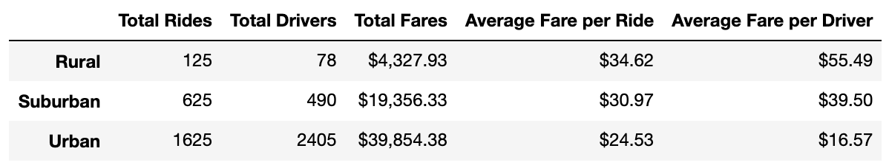
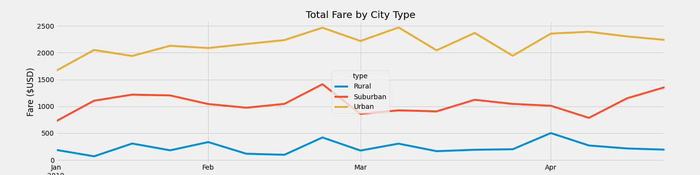

# PyBer Analysis

## New Analysis overview

The purpose of this new analysis is to gain undestanding of metrics by city type, and creating visualizations to validate the performance over an specific time in the different city types.

## Results

By analyzing the overall performance by city we can see the total rides, total drives, total fares, and the average fares per ride and per driver:

### Fig 1 Pyber Summary by type

With 1625 rides in the Urban areas, this type of city outperforms rural and suburban cities by far, as they had  only 78 and 490 rides, respectively.

In terms of fares, Urban cities had a total of $39,854.38, while Suburban cities had approximately half of that with $19,356.33, and cities had approximately one tenth of that, with $4,327.93.

When we see the data over time, we can see the proportionality of the Total Fares, with Urban cities Total Fares being approximately 10 x over Rural Cities and 2x over Suburban Cities:

### Fig 2 Total Fare by City Type over time

Another interesting facts found in the data is that even though the number of total drivers is significantly lower in Rural Cities (78) when compared to Suburban (625) and Urban Cities (2405), the average fares are higher in Rural Cities.

The average fares per Ride in Rural cities is $34.62, while in Suburban Cities it is $30.97 and in Urban Cities it is $24.53.

The average fares per Driver in Rural cities is $55.49, while in Suburban Cities it is $39.50 and in Urban Cities it is $16.57.

That means that the drivers in Suburban and Rural Cities are having higher fares than the ones in Urban Cities.

## Sumary

Here are some recommendations for addressing disparities among the city types:

1. Determine the population of the cities in the database. This will help to guide decisions on whether to invest in increasing the market share and what cities are the focus of the investment.
2. Depending on this initial analysis, invest in increasing the number of drivers in Rural and Suburban Cities: this may help to increase the number of rides, which willl increase the Sum of the fares.
3. Review whether the fares being charged have the same policy by each city type. If they do, probably the average fare per ride and per driver is influenced only by the number of drivers in each city type.
